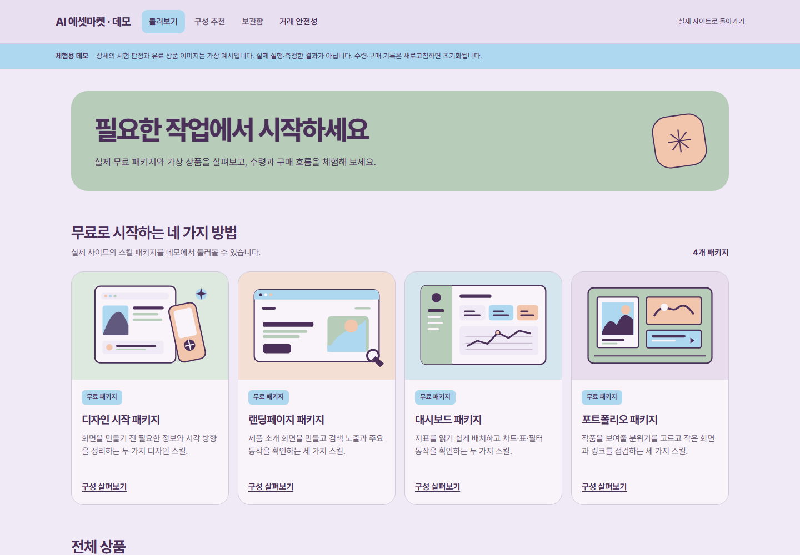
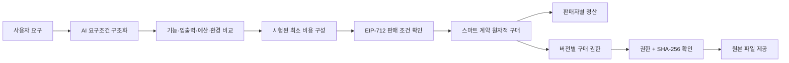
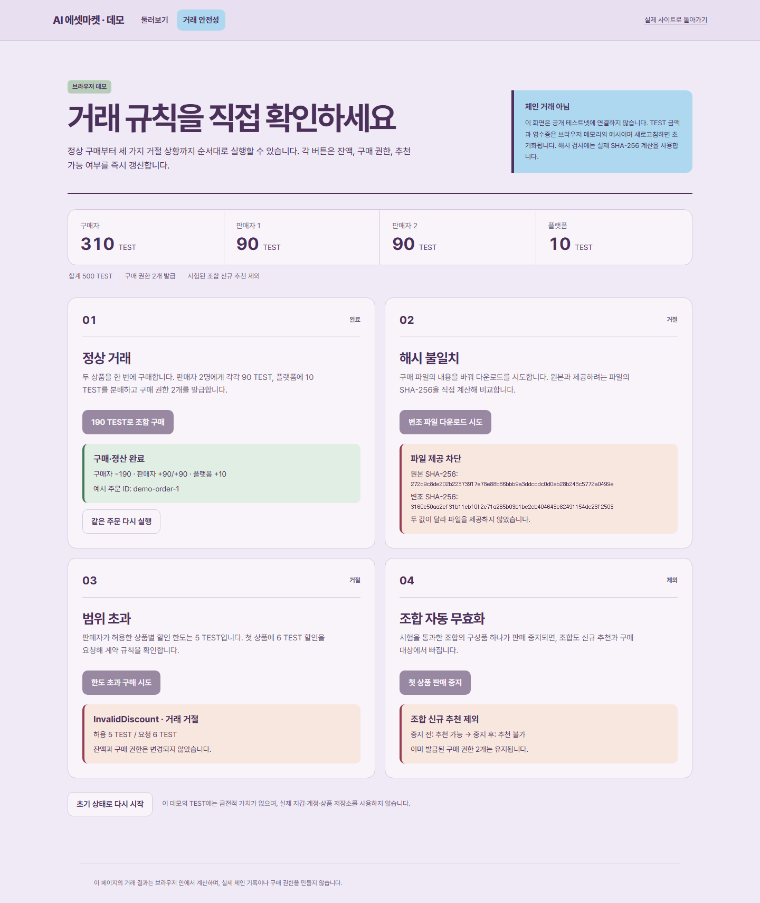

<div align="center">

# AI 에셋마켓

### 검증된 AI Skill과 문서를 찾고, 시험 근거를 비교하고, 안전하게 거래하는 마켓플레이스

[](https://ai-asset-market.vercel.app/demo)
[](https://ai-asset-market.vercel.app/demo/transactions)
[](https://github.com/ldh0906/AI_asset_market/actions/workflows/ci.yml)

`Next.js 16` · `React 19` · `TypeScript` · `Supabase` · `OpenAI Responses API` · `Solidity` · `OpenZeppelin` · `viem`

</div>



## 왜 만들었나요?

AI Skill과 업무 문서는 빠르게 늘고 있지만, 구매자는 **실제로 무엇을 할 수 있는지**, **어떤 환경에서 시험했는지**, **파일이 등록 당시와 같은지** 확인하기 어렵습니다. AI 에셋마켓은 상품 소개와 검증 근거를 분리하고, 정확한 버전과 해시에 구매 권한을 연결합니다.

판매자는 버전별 파일과 이용 조건을 등록하고, 구매자는 요구사항에 맞는 최소 비용 구성을 추천받습니다. 유료 거래는 판매자가 미리 승인한 조건만 사용하며, 구매와 동시에 판매자별 정산과 권한 발급이 한 번에 처리되도록 설계했습니다.

## 핵심 기능

| 영역 | 기능 |
|---|---|
| 상품 탐색 | Skill·문서 검색, 용도·도구·가격 필터, 공개 상품 상세 |
| 검증 리포트 | 파일 해시, 시험 환경, 개별 판정, 한계와 미평가 범위 공개 |
| AI 추천 | 자연어 요구조건 해석, 기능·입출력·예산·환경 기준의 최소 비용 구성 추천 |
| 모델 비교 | 기본 AI·단품·전체 구성의 동일 과제 반복 실행, 토큰·시간·통과율 비교 |
| 안전한 거래 | EIP-712 판매 조건, ERC-1271 서명 확인, 원자적 구매·판매자별 즉시 정산 |
| 파일 제공 | 구매 권한과 SHA-256을 다시 확인한 뒤 비공개 파일 제공 |
| 판매자 작업실 | 버전 등록, 시험 실행, 소개 작성, 판매 승인·중지, 판매 내역 확인 |
| 무료 패키지 | 로그인 후 실제 ZIP 수령, 재로그인 후에도 보관함 기록 유지 |

## AI와 블록체인은 이렇게 연결됩니다



- **AI**는 자연어 목표를 구조화하고, 같은 과제로 기본 모델과 각 자산 구성을 비교합니다. 측정이 끝나지 않은 결과는 성적으로 공개하지 않습니다.
- **블록체인**은 판매자 서명, 할인 한도, 시험 등록, 중복 주문, 구매 권한과 정산을 검증합니다. 어느 한 항목이라도 실패하면 전체 거래가 되돌아갑니다.
- **Supabase**는 인증, 상품 메타데이터, 비공개 파일, 소개 초안과 구매 이력을 관리합니다. 클라이언트가 시험 성적이나 권한을 직접 만들 수 없도록 RLS를 적용합니다.

## 거래 안전성 데모

[직접 실행하기](https://ai-asset-market.vercel.app/demo/transactions) — 로그인과 지갑 없이 아래 네 상황을 순서대로 확인할 수 있습니다.



1. **정상 거래** — 190 TEST를 구매자에게서 차감하고 판매자 두 명에게 90 TEST씩, 플랫폼에 10 TEST를 분배합니다. 구매 권한 두 개가 함께 발급됩니다.
2. **해시 불일치** — 변경된 파일의 SHA-256이 등록값과 다르면 다운로드를 차단합니다.
3. **범위 초과** — 판매자가 허용한 할인보다 큰 값을 요청하면 `InvalidDiscount`로 거절하고 잔액과 권한을 유지합니다.
4. **조합 자동 무효화** — 구성품 하나가 판매 중지되면 해당 조합을 신규 추천과 구매 대상에서 제외합니다. 기존 구매 권한은 유지합니다.

> 웹의 거래 안전성 화면은 발표를 위한 브라우저 시뮬레이션입니다. 동일한 규칙의 Solidity 계약은 로컬 Hardhat 체인과 계약 테스트로 검증했습니다.

## 빠르게 체험하기

### 웹 데모

- [마켓 둘러보기](https://ai-asset-market.vercel.app/demo)
- [거래 안전성 실행](https://ai-asset-market.vercel.app/demo/transactions)
- [운영 사이트](https://ai-asset-market.vercel.app)

### 로컬 실행

Node.js 22.13 이상이 필요합니다.

```bash
git clone https://github.com/ldh0906/AI_asset_market.git
cd AI_asset_market
npm ci
npm run setup:local
npm run contracts:compile
```

터미널 1에서 로컬 체인을 실행합니다.

```bash
npm run chain:local
```

터미널 2에서 앱을 실행합니다.

```bash
npm run dev
```

선택적으로 예제 상품과 실제 로컬 시험 결과를 준비할 수 있습니다.

```bash
npm run seed:local
```

브라우저에서 [http://127.0.0.1:3100](http://127.0.0.1:3100)을 열고 상단의 로컬 계정 선택기로 판매자·구매자 흐름을 체험합니다.

## 프로젝트 구조

```text
src/app/                 Next.js 페이지와 API 라우트
src/components/          마켓·추천·판매자·보관함 UI
src/domain/              금액, 추천, 해시, 조합, 서명 규칙
src/server/              인증, DB, 평가, 파일, 체인 연동
src/ai/                  요구조건 구조와 모델 평가 로직
contracts/               거래 계약과 TEST 토큰
evaluator/               제한된 도구를 실행하는 시험 Worker
supabase/migrations/     스키마, 인덱스와 RLS 정책
tests/                   단위·계약·권한·상태 전이 테스트
e2e/                     Playwright 전체 사용자 흐름
```

## 검증

```bash
npm run contracts:compile
npm run typecheck
npm test
npm run build
npm run test:e2e
```

현재 자동 검증에는 금액 보존, 할인 한도, 중복 주문, 두 판매자 정산, 전체 롤백, 교차 네트워크 서명, 체인 권한, 파일 변조, RLS 권한 상승, AI 비활성화 시 외부 호출 차단 등이 포함됩니다. 브라우저 테스트는 상품 등록부터 시험·추천·구매·다운로드까지의 전체 흐름과 모바일 레이아웃을 확인합니다.

## 환경 변수

배포 설정은 [`.env.example`](.env.example)을 기준으로 구성합니다. 비밀키는 저장소에 커밋하지 않습니다.

| 그룹 | 주요 값 |
|---|---|
| Supabase | `NEXT_PUBLIC_SUPABASE_URL`, `NEXT_PUBLIC_SUPABASE_PUBLISHABLE_KEY`, `SUPABASE_SECRET_KEY` |
| EVM | `CHAIN_RPC_URL`, `CHAIN_ID`, `MARKET_ADDRESS`, `PAYMENT_TOKEN_ADDRESS`, `VALIDATOR_PRIVATE_KEY` |
| AI | `AI_ENABLED`, `OPENAI_API_KEY`, `OPENAI_MODEL` |

AI 호출은 기본적으로 꺼져 있으며 `AI_ENABLED=true`와 모델 설정을 모두 제공해야 활성화됩니다.

## 현재 공개 범위

- 배포 사이트의 무료 상품 수령과 보관함은 Supabase에 연결되어 있습니다.
- 공개 배포의 AI 호출은 비용 통제를 위해 비활성화되어 있습니다. 연결 코드와 평가 흐름은 저장소에 포함되어 있습니다.
- 공개 테스트넷 계약은 아직 연결하지 않았습니다. 유료 거래는 로컬 체인에서 재현할 수 있고, 웹 거래 안전성 페이지는 브라우저 시뮬레이션입니다.
- 모든 금액은 금전적 가치가 없는 `TEST`이며, 데모 데이터는 합성 예제입니다.
- 포함된 무료 ZIP은 각 원본의 라이선스를 따릅니다. 패키지 내부의 `LICENSE.original.txt`와 `SOURCES.json`에서 출처와 고정 커밋을 확인할 수 있습니다.

## License

애플리케이션 코드는 [MIT License](LICENSE)를 따릅니다. 포함된 제3자 패키지와 자료에는 각 원본 라이선스가 우선 적용됩니다.
